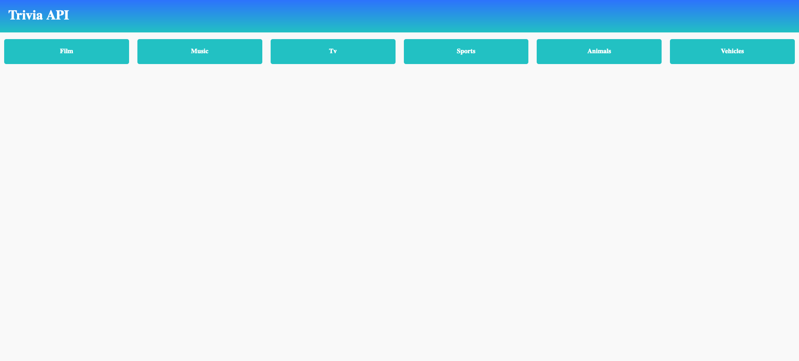
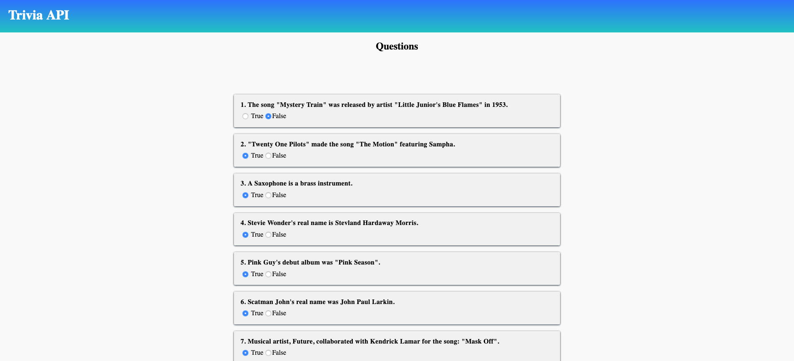
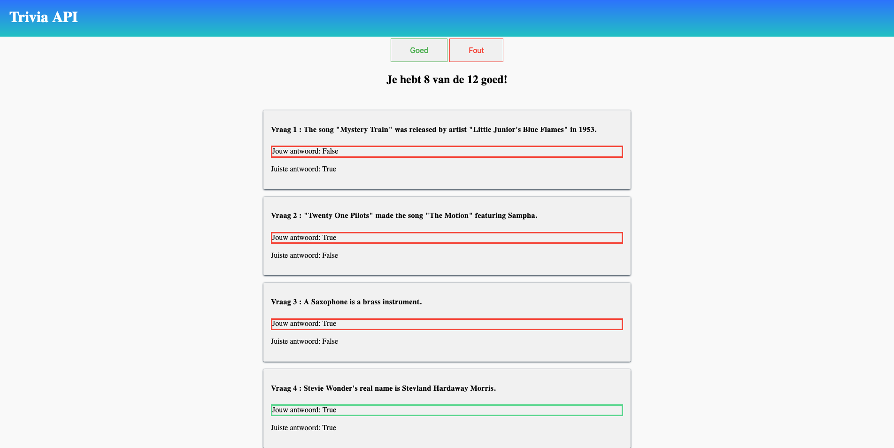
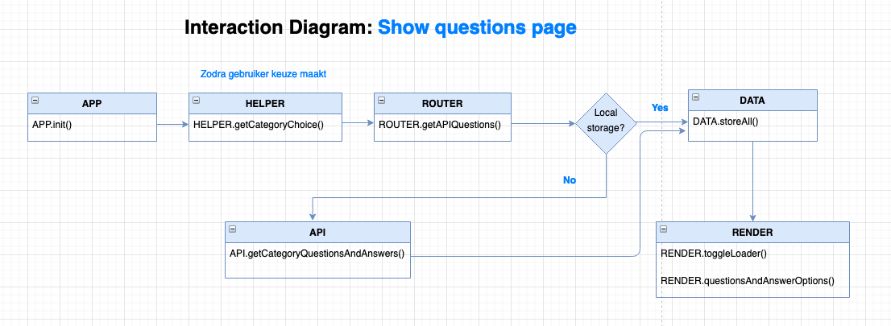
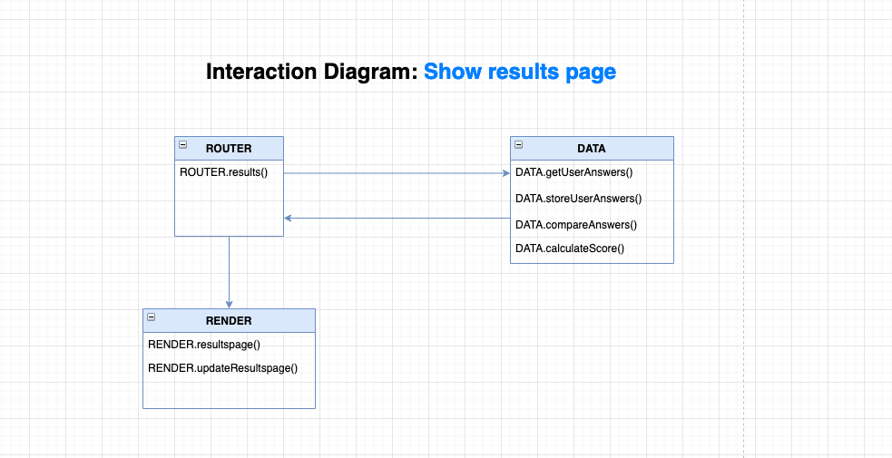

# Web App From Scratch with the Trivia App

## Concept

#### Een client-side trivia app met 12 leuke vragen!

- Stap 1: Selecteer een categorie om vragen over te beantwoorden

- Stap 2: Vul alle 12 vragen in (True or False) en verstuur je antwoorden

- Stap 3: Bekijk je resultaat. Hoeveel vragen heb je goed?

## Live Demo
[live app demo](https://randy554.github.io/wafs-1920/)

### Overzichtspagina



### Vragenpagina



### Resultatenpagina 




### Inhoudsopgave
* [Live Demo](#live-demo)
* [Installeren](#installeren)
* [Actor diagram](#actor-diagram)
* [Interaction diagram](#interaction-diagram)
* [API](#api)
* [To-do](#to-do)
* [Bronnen](#bronnen)
* [License](#license)


## Installeren

```markdown
 
  #1. clone de repo
  https://github.com/randy554/wafs-1920.git

  #2. Navigeer naar de root van de app
  open wafs-1920

  #3. Bekijk site
  Open -> index.html bekijk site: http://localhost:8080

```

## Actor diagram

<details>

<summary>Actor diagram</summary>


</details>

## Interaction diagram

<details>

<summary>Interaction diagram</summary>

 



</details>

## API

De app maakt gebruik van de [Trivia API](https://opentdb.com/api_config.php). De response data is <strong>JSON</strong>. Er kan gebruik worden gemaakt van een SESSION TOKEN. Deze zorgt ervoor dat gedurende de sessie alleen maar unieke vragen worden terug gestuurd. De sessie doet 6 uur. Verder kan de API zonder key worden gebruikt. Er is in de documentatie helaas niks te
vinden over limiet van API gebruik.

#### Voorbeeld van response data:
https://opentdb.com/api.php?amount=12&category=12&difficulty=easy&type=boolean


#### Omschrijving
De API biedt de mogelijkheid om tussen de 1 en 50 Trivia vragen te terug te krijgen. Deze vragen kunnen gaan over verschillende categoriën zoals politiek & geschiedenis. Verder kun je de moeilijkheidsgraad van de vragen aanpassen op easy, medium en hard. Ook kan er gekozen worden om multiple choice antwoorden of boolean antwoorden te ontvangen.


## To Do
 - [x] WAFS Github forken
 - [x] WAFS Project in Github aanmaken
 - [x] API vinden
 - [x] Readme updaten

 - [x] API call uitvoeren
 - [x] HTML code schrijven
 - [x] CSS toevoegen
 - [x] Refactor JS
 - [x] Actor diagram
 - [x] Fetch error handeling
 - [x] Template engine transparency installeren

 - [x] fix module probleem
 - [x] fix routie import problemen


## Libraries

[Routi](http://projects.jga.me/routie/)

## Bronnen

* [insertAdjacentHTML](https://www.w3schools.com/jsref/met_node_insertadjacenthtml.asp)
* [appendChild](https://www.w3schools.com/jsref/met_node_appendchild.asp)
* [Get url parameters](https://stackoverflow.com/questions/523266/how-can-i-get-a-specific-parameter-from-location-search)
* [Local storage](https://www.youtube.com/watch?v=T9GWHFDcELQ)
* [Map](https://developer.mozilla.org/en-US/docs/Web/JavaScript/Reference/Global_Objects/Array/map)
* [Reduce](https://www.youtube.com/watch?v=-LFjnY1PEDA&t=348s)
* [Filter](https://www.youtube.com/watch?v=qmnH5MT_luk&t=146s)

## License

Creative Commons Attribution-ShareAlike 4.0 International <a href="License https://creativecommons.org/licenses/by-sa/4.0/" alt="Creative Commons Licens"> Link </a>
